# LaTeX Document Skill v2

`latex-document` v2 turns the skill from a large template/script collection into a production document workflow: scaffold a project, build it with the right backend, check readiness, package the handoff, and keep the test suite stable across local environments.

## Quick path

1. Create a project workspace.
2. Author content in `content/`, `figures/`, and `data/`.
3. Validate structure and build with the backend that matches the document.
4. Run accessibility readiness checks before final handoff.
5. Package PDF + source + manifest for submission.

```bash
bash <skill_path>/scripts/init_document_project.sh ./my-document \
  --title "My Report" \
  --author "Author Name"

bash <skill_path>/scripts/check_document_project.sh ./my-document
bash <skill_path>/scripts/build_document_project.sh ./my-document
bash <skill_path>/scripts/check_accessibility.sh ./my-document --strict
bash <skill_path>/scripts/package_submission.sh ./my-document --zip
```

## v2 at a glance



Source: [`diagrams/latex-document-v2-capability-map.mmd`](diagrams/latex-document-v2-capability-map.mmd)

| Slice | User outcome | Main files |
|---|---|---|
| Project scaffolding | Start from a repeatable document workspace instead of loose `.tex` files. | `scripts/init_document_project.sh`, `scripts/check_document_project.sh`, `scripts/build_document_project.sh`, `assets/scaffolds/document-project/`, `references/project-scaffolding.md` |
| Submission packaging | Deliver a clean package with final PDF, source, manifest, checklist, and optional ZIP. | `scripts/package_submission.sh`, `references/submission-packaging.md` |
| Tectonic backend | Use Tectonic for constrained reproducible builds when the document does not need BibTeX/biber/index/glossary passes. | `scripts/compile_latex.sh`, `scripts/build_document_project.sh` |
| Accessibility readiness | Catch common source/PDF handoff problems before archive, thesis, client, or course submission. | `scripts/check_accessibility.sh`, `references/accessibility-guide.md` |
| Suite stabilization | Make shell validation useful across MiKTeX and dependency-variable machines. | `tests/run_all_tests.sh`, `tests/test_templates.sh`, `tests/test_analysis_tools.sh`, `tests/test_pdf_utils.sh` |

## Production workflow



Source: [`diagrams/latex-document-v2-release-flow.mmd`](diagrams/latex-document-v2-release-flow.mmd)

## Backend decision table

| Need | Use | Why |
|---|---|---|
| Normal documents, references, indexes, glossaries, or broad LaTeX compatibility | Default multi-pass build | Handles bibliography/index/glossary workflows and broad package behavior. |
| Dependency tracking and automatic repeated passes | `--use-latexmk` | Lets `latexmk` drive pass scheduling when installed. |
| Constrained reproducible bundle-based build | `--use-tectonic` | Good for simple documents without external auxiliary tools. |
| PDF/A or archive handoff | Default build plus `--pdfa`, then accessibility check | Keeps archival requirements explicit and validated. |

Tectonic is intentionally not a drop-in replacement for every LaTeX project. It refuses documents that require BibTeX, biber, makeindex, or makeglossaries because those workflows need auxiliary passes outside the constrained Tectonic path.

## Accessibility readiness checks

Run this before final delivery:

```bash
bash <skill_path>/scripts/check_accessibility.sh ./my-document
bash <skill_path>/scripts/check_accessibility.sh ./my-document --strict
bash <skill_path>/scripts/check_accessibility.sh ./my-document --json
```

The checker is source-first and dependency-light:

- walks `\input{...}` and `\include{...}` source graphs;
- reads `document.yaml`, `\title{}`, `\author{}`, `pdftitle=`, `pdfauthor=`, and adjacent `*.xmpdata` metadata;
- checks for `hyperref`/`pdfx` readiness;
- warns on missing caption/description signals and raw URLs;
- validates PDF headers;
- uses `pdfinfo` and `qpdf` when available for metadata/encryption probes.

Use `--strict` when a warning should block final handoff.

## Packaging contract

The submission packager creates a bounded package under `outputs/<package-dir>` and protects the source project:

- refuses unsafe output paths and traversal;
- refuses symlinks in package inputs;
- stages package output before replacing previous package artifacts;
- can produce ZIP archives;
- includes a manifest and submission checklist.

```bash
bash <skill_path>/scripts/package_submission.sh ./my-document
bash <skill_path>/scripts/package_submission.sh ./my-document --zip --name final-submission
```

## Test evidence and local dependency skips

The v2 test runner is strict about failures but explicit about unavailable optional dependencies.

```bash
bash <skill_path>/tests/run_all_tests.sh
```

Expected behavior:

| Situation | Result |
|---|---|
| Runnable shell suite fails | Overall run fails. |
| Optional dependency missing, such as `pytest` or `qpdf` | Suite is reported as skipped, not passed. |
| No runnable suites remain | Overall run fails. |
| MiKTeX returns non-zero while producing a valid fresh PDF | Compile wrapper validates the PDF before deciding whether recovery is needed. |
| A template compiles slowly due first-run font generation | Per-template timeout protects against hangs while allowing slow bootstrap. |

## Review checklist

Use this checklist before calling a v2 document ready:

- [ ] Project structure passes `check_document_project.sh`.
- [ ] Build backend matches document needs.
- [ ] Final PDF exists and is fresh.
- [ ] Accessibility check passes, preferably with `--strict` for final delivery.
- [ ] Submission package was generated under `outputs/`.
- [ ] Manifest and checklist are included in the package.
- [ ] `tests/run_all_tests.sh` has no failures; dependency skips are understood.

## Related references

- [Project scaffolding](project-scaffolding.md)
- [Submission packaging](submission-packaging.md)
- [Accessibility guide](accessibility-guide.md)
- [Script tools](script-tools.md)
- [Debugging guide](debugging-guide.md)
