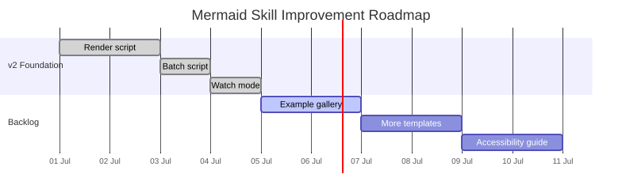

<!-- markdownlint-disable MD013 -->

# Mermaid Skill Example Gallery

This gallery provides ready-to-render examples. Each `.mmd` file should have matching `.svg` and `.png` outputs in `rendered/` after running the batch command.

## Render the gallery

From the repository root:

```bash
SKILL_DIR=path/to/mermaid-document-diagrams
node "$SKILL_DIR/scripts/batch.mjs" \
  --input-dir "$SKILL_DIR/assets/gallery" \
  --output-dir "$SKILL_DIR/assets/gallery/rendered" \
  --format svg,png \
  --backend mmdc
```

Set `SKILL_DIR` to the actual installed path. In UPDS, use
`SKILL_DIR=SKILLS/mermaid-document-diagrams`.

## Examples

| Source | Rendered PNG | Demonstrates |
| --- | --- | --- |
| `skill-workflow.mmd` | `rendered/skill-workflow.png` | v2 validation and export workflow |
| `product-roadmap-gantt.mmd` | `rendered/product-roadmap-gantt.png` | timeline planning with `gantt` |
| `knowledge-map.mmd` | `rendered/knowledge-map.png` | concept map with `mindmap` |
| `student-service-journey.mmd` | `rendered/student-service-journey.png` | user experience flow with `journey` |
| `system-context-c4.mmd` | `rendered/system-context-c4.png` | high-level system context with `C4Context` |

## Accessibility examples

Use meaningful alt text when embedding rendered examples:

```markdown

```

```markdown

```

Use these examples as starting points, not final project diagrams. Replace labels with the user's domain language before export.
