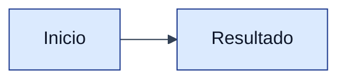

<!-- markdownlint-disable MD013 -->

# Mermaid Document Themes

Use these presets as decision guidance. Mermaid CLI supports `default`, `dark`, `neutral`, and `forest` via `--theme`. Richer branding should be placed inside the `.mmd` with an `%%{init: ...}%%` block.

## Recommended choices

| Context | Theme | Background | Notes |
| --- | --- | --- | --- |
| General docs | `neutral` | `white` | Clean and printable |
| GitHub README | `default` or `neutral` | `white` | Most portable |
| Presentations | `neutral` | `white` | Export PNG at 2048px+ |
| Dark docs | `dark` | `transparent` or dark | Verify contrast in target document |
| UPDS docs | Custom init block | `white` | Use UPDS blue as accent |

## UPDS-style init block

Keep theme choices secondary to legibility. A beautiful diagram that cannot be read in the destination document fails the skill.
